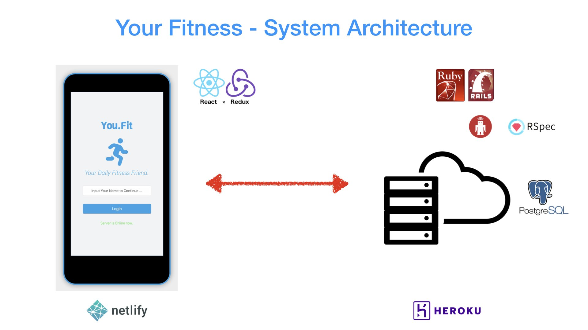
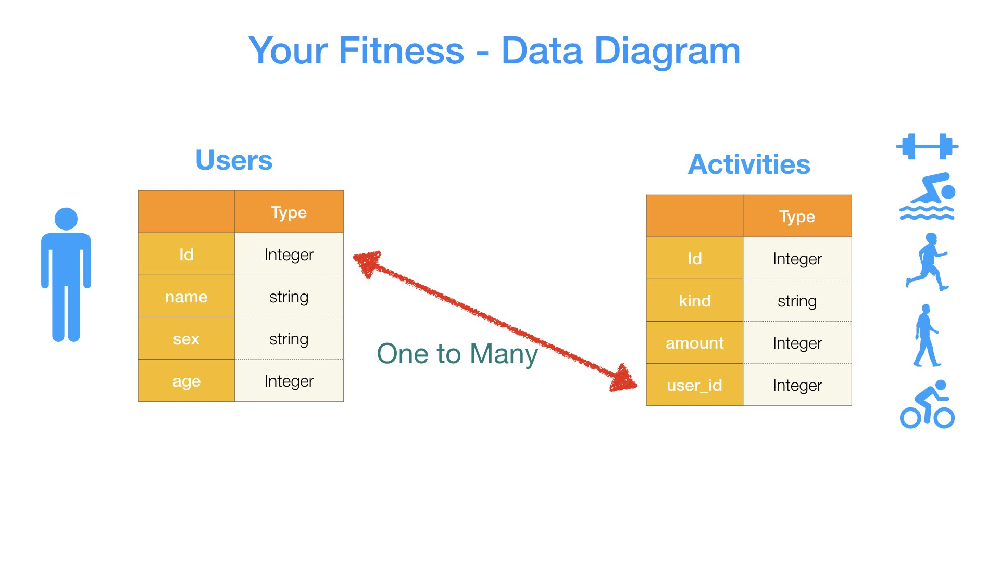
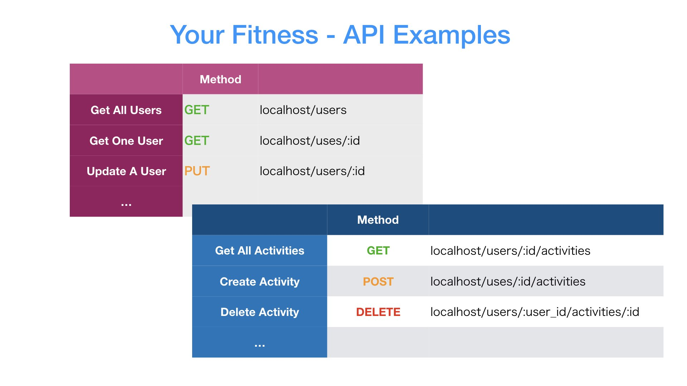

<h1 align="center">🕴️ Your Fitness API (backend) 🕴️</h1>
<p align="center">
  
  <a href="https://github.com/kelvin8773/your-fitness" target="_blank">
    
  </a>
  <a href="https://github.com/kelvin8773/your-fitness-api/blob/master/LICENSE" target="_blank">
    
  </a>
  <a href="https://twitter.com/kelvin9877" target="_blank">
    
  </a>
</p>

[](https://youfit.netlify.com)
[](https://youfit.netlify.com)
[](https://youfit.netlify.com)

> This is the backend repo for the full stack project - Your Fitness App.

### ✨ [FrontEnd Demo](https://youfit.netlify.com/)

## Project Detail

### Tech Stacks
* Ruby On Rails
* Postgre
* Rspec

### Current Features
* CRUD for Users Model (get, post, put, delete);
* CRUD for Activities Model (get, post, put, delete);

### Planing Features
* User Authentication
* Add more models

## Project Setup

### Prerequisite
* Ruby 2.6.3 or above;
* Rails 6.0.2

### Install

> Install Necessary Packages.
```sh
bundle install
```

> Create Database.
```sh
rails db:migrate
```

> Add Sample Data.
```sh
rails db:seed
```

### Run Server

```sh
rails server
```

### Run tests

```sh
rspec
```

## Author

👤 **Kelvin Liang**

* Website: kelvinliang.cn
* Twitter: [@kelvin9877](https://twitter.com/kelvin9877)
* Github: [@kelvin8773](https://github.com/kelvin8773)
* LinkedIn: [@kelvin9877](https://linkedin.com/in/kelvin9877)

## 🤝 Contributing

Contributions, issues and feature requests are welcome!<br />Feel free to check [issues page](https://github.com/kelvin8773/your-fitness-api/issues). You can also take a look at the [contributing guide](https://github.com/kelvin8773/your-fitness-api/pulls).

## Show your support

Give a ⭐️ if this project helped you!

## 📝 License

Copyright © 2020 [Kelvin Liang](https://github.com/kelvin8773).<br />
This project is [MIT](https://github.com/kelvin8773/your-fitness-api/blob/master/LICENSE) licensed.

***
_This README was generated with ❤️ by [readme-md-generator](https://github.com/kefranabg/readme-md-generator)_